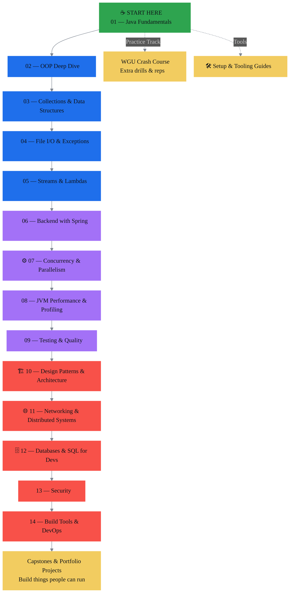

<h1 align=center>
☕ Learn Java — From Zero to Advanced ☕
</h1>

Welcome to <strong>Learn Java</strong>, a structured, beginner-friendly course that guides you from writing you <strong>very first Java program</strong> all the way to <strong>advanced backend and performance topics</strong>.
 
 
This repository is designed to feel like a <strong>full online course in GitHub form</strong> — with lessons, mini-projects, practice exercises, and larger challenges along the way.

  
  &nbsp;&nbsp;
  
  &nbsp;&nbsp;
  

> 🚧 **Project Status:** This course is actively being built.  

> ✅ **Lesson 1 (Java Basics & Program Structure)** is mostly complete. 

> 🔜 Additional lessons and modules are in progress.

---

<h2 align=center>
🎯 Who This Course Is For
</h2>

This course is for: 
- Absolute beginners who have **never coded before**
- Self-taught developers who want **strong Java fundamentals**
- Students preparing for **college courses or certifications**
- Developers moving into **backend Java development**

No prior programming experience is required at the start.

---

<h2 align=center>
🎯 🧠 How This Course Is Structured
</h2>

The course is divided into **progressive modules**. Each module builds on the previous one and includes:

- 📖 Clear written lessons  
- 💻 Example Java programs  
- 🧪 Practice exercises  
- 🎯 Mini projects  
- 🧩 Challenges (optional, harder)

You’ll go from printing text…  
to building logic…  
to working with data…  
to creating real backend systems.

---

<h2 align=center>
🗺️ Course Roadmap (This Repo)
</h2>

**Quick Links:**  
[01 Fundamentals](01-java-fundamentals/) •
[02 OOP](02-java-oop-deep-dive/) •
[03 Collections](03-java-collections-and-data-structures/) •
[04 File I/O](04-java-file-io-and-exceptions/) •
[05 Streams](05-java-streams-and-lambdas/) •
[06 Spring](06-java-backend-with-spring/) •
[07 Concurrency](07-java-concurrency-and-parallelism/) •
[08 JVM Perf](08-java-jvm-performance-and-profiling/) •
[09 Testing](09-java-testing-and-quality/) •
[10 Patterns](10-java-design-patterns-and-architecture/) •
[11 Networking](11-java-networking-and-distributed-systems/) •
[12 SQL](12-java-databases-and-sql-for-devs/) •
[13 Security](13-java-security/) •
[14 DevOps](14-java-build-tools-and-devops/)

---

<h2 align=center>
🟢 Current Progress
</h2>

| Module | Status |
|-------|--------|
| **01 — Java Fundamentals** | 🟡 In Progress (Lesson 1 mostly complete) |
| 02 — OOP | ⚪ Not Started |
| 03 — Collections | ⚪ Not Started |
| 04+ Advanced Modules | ⚪ Planned |

---

<h2 align=center>
💻 How to Use This Repository
</h2>

1. Start inside: `01-java-fundamentals`
2. Go through lessons in order.
3. Read each lesson’s `README.md`
4. Run the example `.java` files
5. Complete the practice programs and challenges

This course is designed to be **hands-on**. You should be writing and running code constantly.

---

<h2 align=center>
🛠️ What You Need
</h2>

### **For Course 01 — Java Fundamentals**
You can complete the entire first course using **VS Code**.

Recommended setup:
- Java JDK (version 17 or newer)
- VS Code
- VS Code Extension Pack for Java

This keeps things lightweight and beginner-friendly.

### **For Later Courses (OOP and Beyond)**
As the course progresses into larger projects, frameworks, and backend development, you may benefit from using a full-featured Java IDE such as **IntelliJ IDEA**.

We’ll clearly note when a lesson is easier with an advanced IDE — but you can start everything with VS Code.

---

<h2 align=center>
🚀 Long-Term Goal of This Course
</h2>

By the end of this curriculum, you should be able to:

✔ Write clean Java programs  
✔ Understand object-oriented design  
✔ Work with real-world data  
✔ Build backend services  
✔ Read and understand professional Java code  

This repo is being built to grow into a **complete Java learning path** from beginner to advanced developer.

---

<h2 align="center">
🧭 When to Start Applying for Junior Jobs
</h2>

A good rule: **start applying earlier than you feel “ready”** — but aim to have *proof* you can build things.

### ✅ Minimum “apply now” readiness (recommended)
You can start applying when you can:
- Finish **Fundamentals + OOP + Collections** (or equivalent skill level)
- Build **2–3 small projects** (CLI apps are fine early on)
- Build **1 portfolio-ready project** you can demo (later: small backend API)
- Use **Git/GitHub confidently** (commits, branches, README, pushing)
- Explain your code out loud (basic interview communication)

### 🚀 Stronger (higher callback rate)
You’ll get more traction once you also have:
- A simple **REST API** project (Spring later in the course)
- Basic testing (even a few unit tests)
- Familiarity with data structures + problem solving (loops, arrays/lists, maps)
- A clean README + screenshots/gifs + “how to run” instructions

### Practical timeline in this course
- After **Module 01**: You can start *light* applying + networking (especially internships/trainee roles)
- After **Module 02–03**: Solid time to apply broadly to junior roles
- After **Module 06 (Spring)**: You’re in a strong position for backend-focused junior jobs

---

<h2 align=center>
📌 Final Note
</h2>

This is a **living project**. Lessons will continue to be added and improved over time.

If you're here early — welcome to the ground floor 👋  